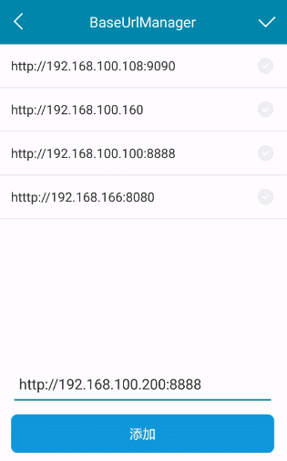

# BaseUrlManager

[](https://raw.githubusercontent.com/jenly1314/BaseUrlManager/master/app/release/app-release.apk)
[](https://jitpack.io/#jenly1314/BaseUrlManager)
[](https://travis-ci.org/jenly1314/BaseUrlManager)
[](https://android-arsenal.com/api?level=16)
[](https://opensource.org/licenses/mit-license.php)
[](https://jenly1314.github.io)
[](http://shang.qq.com/wpa/qunwpa?idkey=8fcc6a2f88552ea44b1411582c94fd124f7bb3ec227e2a400dbbfaad3dc2f5ad)

BaseUrlManager for Android 的设计初衷主要用于开发时，有多个环境需要打包APK的场景，通过BaseUrlManager提供的BaseUrl动态设置入口，只需打一次包，即可轻松随意的切换不同的开发环境或测试环境。在打生产环境包时，关闭BaseUrl动态设置入口即可。

> 妈妈再也不用担心因环境不同需要打多个包的问题，从此告别环境不同而写一堆配置的烦恼。

## Gif 展示


## 引入

### Maven：
```maven
<dependency>
  <groupId>com.king.base</groupId>
  <artifactId>base-url-manager</artifactId>
  <version>1.0.0</version>
  <type>pom</type>
</dependency>
```
### Gradle:
```gradle
implementation 'com.king.base:base-url-manager:1.0.0'
```

### Lvy:
```lvy
<dependency org='com.king.base' name='base-url-manager' rev='1.0.0'>
  <artifact name='$AID' ext='pom'></artifact>
</dependency>
```

###### 如果Gradle出现implementation失败的情况，可以在Project的build.gradle里面添加如下：（也可以使用上面的GitPack来implementation）
```gradle
allprojects {
    repositories {
        maven { url 'https://dl.bintray.com/jenly/maven' }
    }
}
```

## 引入的库：
```gradle
api 'com.android.support:appcompat-v7:28.0.0'
compileOnly 'com.android.support:recyclerview-v7:28.0.0'
```

## 示例

集成步骤代码示例 （示例出自于[app](app)中）

Step.1 在您项目中的AndroidManifest.xml中通过配置meta-data来自定义全局配置
```xml
    <!-- 在你项目中添加注册如下配置 -->
    <activity android:name="com.king.base.baseurlmanager.BaseUrlManagerActivity"
        android:screenOrientation="portrait"
        android:theme="@style/BaseUrlManagerTheme"/>
```

Step.2 在您项目Application的onCreate方法中初始化BaseUrlManager

```java
    //初始化BaseUrlManager
    mBaseUrlManager = new BaseUrlManager(this);
   
    //获取baseUrl
    String baseUrl = mBaseUrlManager.getBaseUrl();
    
    //也可以通过暴露方法获取BaseUrl
    /**
     * 获取baseUrl
     * @return {@link #mBaseUrlManager#getBaseUrl()}
     */
    public String getBaseUrl() {
        return mBaseUrlManager.getBaseUrl();
    }

```

Step.3 提供动态配置BaseUrl的入口（通过Intent跳转到BaseUrlManagerActivity界面）
```JAVA
    Intent intent = new Intent(this, BaseUrlManagerActivity.class);
    //BaseUrlManager界面的标题
    //intent.putExtra(BaseUrlManagerActivity.KEY_TITLE,"BaseUrl配置");
    //跳转到BaseUrlManagerActivity界面
    startActivityForResult(intent,SET_BASE_URL_REQUEST_CODE);
```  

Step.4 当配置改变了baseUrl时，只需通过BaseUrlManager刷新下数据，重新获取baseUrl即可
```java
    //刷新数据
    mBaseUrlManager.refreshData();

    //获取baseUrl
    mBaseUrlManager.getBaseUrl();

```      

更多使用详情，请查看[app](app)中的源码使用示例

## 版本记录

#### v1.0.0：2019-6-11
*  BaseUrlManager初始版本

## 赞赏
如果您喜欢BaseUrlManager，或感觉BaseUrlManager帮助到了您，可以点右上角“Star”支持一下，您的支持就是我的动力，谢谢 :smiley:<p>
您也可以扫描下面的二维码，请作者喝杯咖啡 :coffee:
    <div>
        
        
        
        
    </div>

## 关于我
   Name: <a title="关于作者" href="https://about.me/jenly1314" target="_blank">Jenly</a>

   Email: <a title="欢迎邮件与我交流" href="mailto:jenly1314@gmail.com" target="_blank">jenly1314#gmail.com</a> / <a title="给我发邮件" href="mailto:jenly1314@vip.qq.com" target="_blank">jenly1314#vip.qq.com</a>

   CSDN: <a title="CSDN博客" href="http://blog.csdn.net/jenly121" target="_blank">jenly121</a>

   Github: <a title="Github开源项目" href="https://github.com/jenly1314" target="_blank">jenly1314</a>

   加入QQ群: <a title="点击加入QQ群" href="http://shang.qq.com/wpa/qunwpa?idkey=8fcc6a2f88552ea44b1411582c94fd124f7bb3ec227e2a400dbbfaad3dc2f5ad" target="_blank">20867961</a>
   <div>
       
       
   </div>